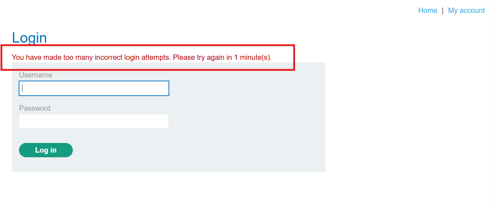

# Lab: Broken brute-force protection, IP block

**Platform:** PortSwigger Web Security Academy  
**Category:** Authentication  
**Vulnerability:** Broken brute-force protection (IP-based blocking)  
**Difficulty:** Practitioner  
**Lab Link:** [Broken brute-force protection, IP block](https://portswigger.net/web-security/authentication/password-based/lab-broken-bruteforce-protection-ip-block) 
This write-up covers the exploitation of a logic flaw in a brute-force protection mechanism. The application blocks an IP address after 3 failed attempts, but a successful login resets this counter for the attacker's IP.

## Vulnerability Description
The website implements IP-based rate limiting to prevent brute-force attacks. However, it incorrectly resets the failure count for an IP address upon any successful login from that IP. By alternating between our legitimate credentials (`wiener:peter`) and brute-force attempts on the victim (`carlos`), we can keep the failure counter at zero and bypass the protection.

### 1. Analysis of the Protection Mechanism
Attempting to log in as `carlos` with an incorrect password more than three times triggers a temporary IP block.

