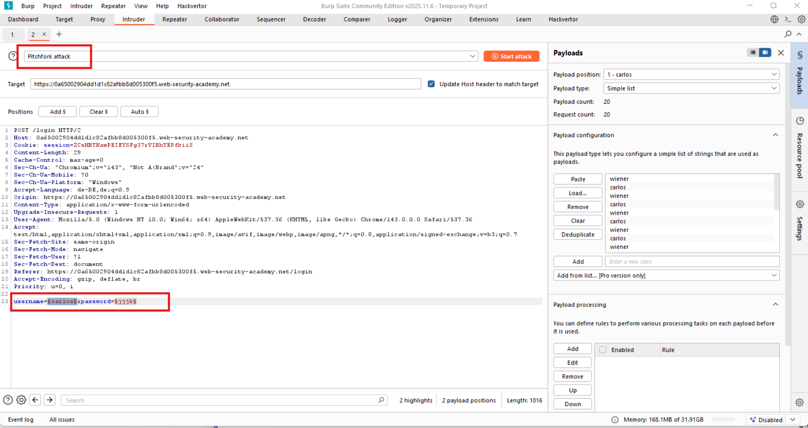
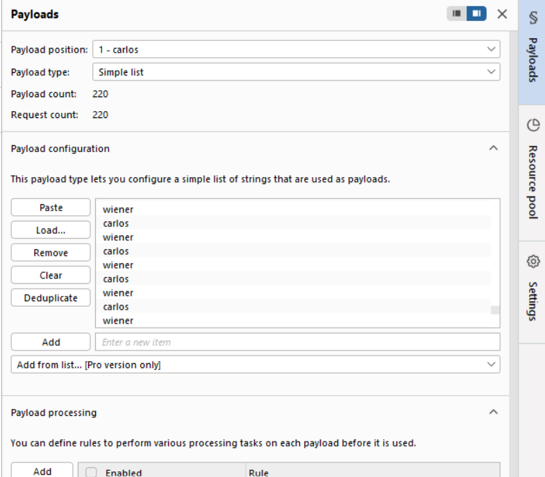
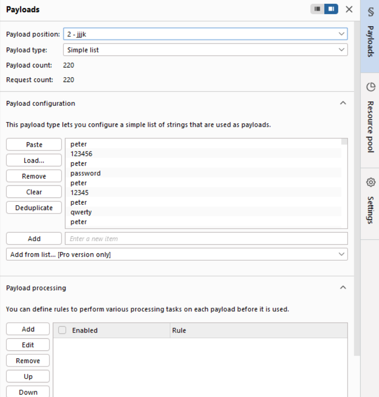
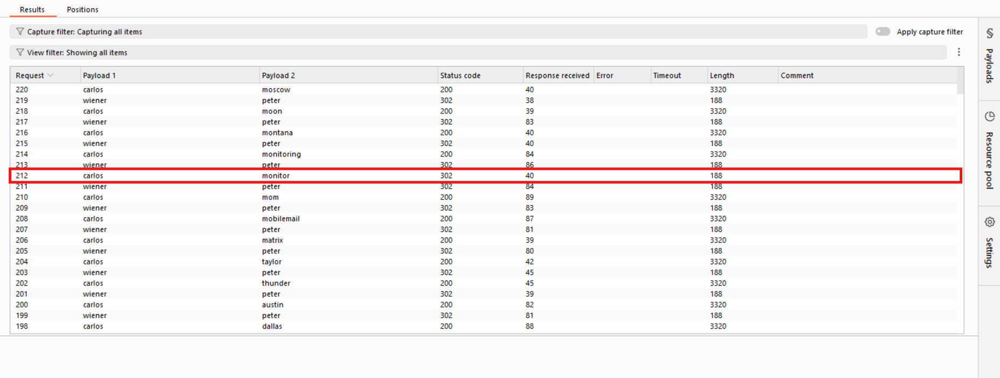

# Lab: Broken brute-force protection, IP block

**Platform:** PortSwigger Web Security Academy  
**Category:** Authentication  
**Vulnerability:** Broken brute-force protection (IP-based blocking)  
**Difficulty:** Practitioner  
**Lab Link:** [Broken brute-force protection, IP block](https://portswigger.net/web-security/authentication/password-based/lab-broken-bruteforce-protection-ip-block) 
This write-up covers the exploitation of a logic flaw in a brute-force protection mechanism. The application blocks an IP address after 3 failed attempts, but a successful login resets this counter for the attacker's IP.

## Vulnerability Description
The website implements IP-based rate limiting to prevent brute-force attacks. However, it incorrectly resets the failure count for an IP address upon any successful login from that IP. By alternating between our legitimate credentials (`wiener:peter`) and brute-force attempts on the victim (`carlos`), we can keep the failure counter at zero and bypass the protection.

### 1. Analysis of the Protection Mechanism
Attempting to log in as `carlos` with an incorrect password more than three times triggers a temporary IP block.

### 2. Capturing the Request
Using **Burp Suite Proxy**, I intercepted a `POST /login` request and sent it to the **Intruder**. To bypass the block, I selected the **Pitchfork** attack type.

* **Positions:** Set markers on the `username` and `password` parameters.

### 3. Configuring Alternating Payloads
According to the lab requirements, a successful login as `wiener` must precede each attempt to guess `carlos`'s password to reset the IP block.

* **Payload Set 1 (Usernames):** Alternating between `wiener` and `carlos` (200+ rows). 

* **Payload Set 2 (Passwords):** Alternating between `peter` and the provided candidate passwords (200+ rows).

### 4. Resource Pool Configuration
To ensure requests are sent in the strict alternating order (`wiener` then `carlos`), I created a new **Resource Pool** with `Maximum concurrent requests` set to **1**.
### 5. Obtaining the Result
After running the attack, I filtered the results by the `302 Found` status code. Among the successful logins for `wiener`, I found exactly one `302` redirect for user `carlos`.

