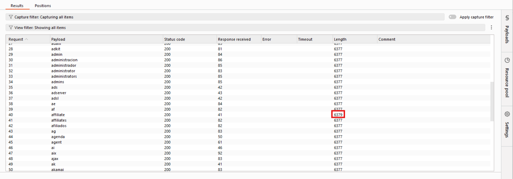

# Lab: Username enumeration via different responses

**Category:** Authentication
**Difficulty:** APPRENTICE
**Lab Link:** [PortSwigger Academy](https://portswigger.net/web-security/authentication/password-based/lab-username-enumeration-via-different-responses)

---

##  Objective
The goal of this lab is to demonstrate how subtle differences in HTTP responses can be used to enumerate valid usernames and subsequently perform a successful brute-force attack to compromise a user account.

##  Tools
- **Burp Suite** (Proxy, Intruder)
- **Wordlists:** Candidate usernames and passwords provided by PortSwigger.

##  Exploitation Steps

### 1. Analysis of Server Behavior
- Navigated to the login page and captured a login attempt (e.g., `invalid_user:invalid_password`) using Burp Suite Proxy.
- Sent the request to **Intruder** (`Ctrl + I`).
- Noticed that the application responds with a specific error message: `"Invalid username"`.

### 2. Username Enumeration Attack
- **Positions:** Set the payload position on the `username` parameter.
- **Attack Type:** `Sniper`.
- **Payloads:** Loaded the provided list of candidate usernames.
- **Analysis:** After running the attack, I inspected the results. 
- **Finding:** One specific username resulted in a response that differed from the others (e.g., a different response length or a slightly different error message like `"Invalid password"`). This confirmed the existence of a valid user.
-  

### 3. Password Brute-force Attack
- Returned to **Intruder** and updated the `username` parameter with the valid name found in Step 2.
- **Positions:** Set the payload position on the `password` parameter.
- **Payloads:** Loaded the provided list of candidate passwords.
- **Result:** One request yielded an HTTP **302 Found** status code. This indicates a successful authentication and a redirect to the user's account page.
-  

##  Remediation
To prevent username enumeration and brute-force attacks, the following measures should be implemented:
1. **Generic Error Messages:** Use a non-specific message for all failed login attempts, such as *"Invalid username or password"*.
2. **Rate Limiting:** Implement account lockout or delays after a certain number of failed attempts to prevent automated brute-force attacks.
3. **Consistent Response Times:** Ensure the application's response time is consistent, regardless of whether the username is valid, to prevent timing attacks.
