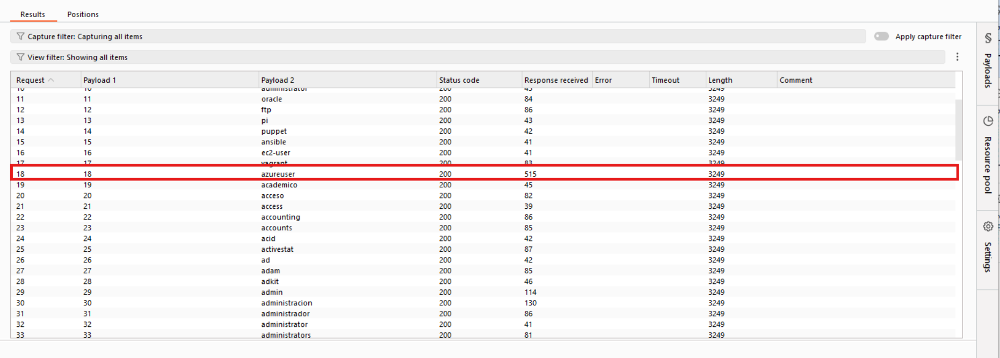
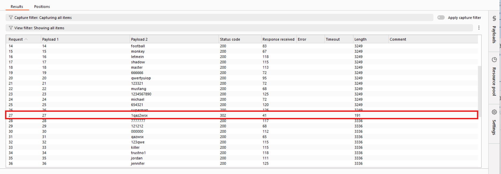

# Username Enumeration via Response Timing

##  Lab Description
This lab demonstrates how an authentication mechanism can unintentionally
leak information about valid usernames through **response timing differences**.

Although the application returns identical error messages for invalid login
attempts, the time taken to process authentication requests varies depending
on whether the supplied username exists. This behavior allows an attacker to
enumerate valid usernames and subsequently brute-force passwords.

**Lab Link:**  [Username enumeration via response timing](https://portswigger.net/web-security/authentication/password-based/lab-username-enumeration-via-response-timing)

---

## 🎯 Objective
- Identify a valid username using response timing analysis
- Bypass IP-based brute-force protection
- Brute-force the password for the identified user
- Successfully authenticate and complete the lab

---

##  Tools Used
- Burp Suite (Repeater, Intruder)
- Web browser

---

##  Write-up

### Step 1: Username Enumeration via Response Timing

An invalid login request was intercepted and analyzed using Burp Repeater.
After several failed attempts, the application temporarily blocked the client
IP address, indicating the presence of IP-based brute-force protection.

This restriction was bypassed by adding the `X-Forwarded-For` header to the
request, allowing the IP address to be spoofed.

To identify timing discrepancies, a very long static password was used while
testing different usernames. Authentication attempts with invalid usernames
consistently returned responses within a similar time range. However, when a
valid username was supplied, the server response time increased noticeably.

This behavior indicates that additional password verification logic is
executed only when the username exists, enabling username enumeration through
response timing analysis.

📸 **Username enumeration via response timing:**  

---

### Step 2: Password Brute-force

After identifying a valid username, a password brute-force attack was
performed using Burp Intruder. The `X-Forwarded-For` header was included again
to bypass IP-based rate limiting.

One of the authentication attempts resulted in a **302 redirect**, indicating
a successful login and confirming the correct password for the identified
user.

📸 **Password brute-force success:**  

---

##  Result
The lab was successfully completed by exploiting response timing differences
in the authentication mechanism to enumerate a valid username and brute-force
the corresponding password.

---

##  Root Cause
The application processes authentication requests differently depending on
whether a username exists. Password verification logic is executed only for
valid usernames, resulting in measurable response time differences. This lack
of constant-time authentication handling enables username enumeration through
timing analysis.

---

##  Mitigation
- Ensure authentication logic executes in constant time regardless of
  username validity
- Normalize response timing for both valid and invalid usernames
- Avoid trusting client-supplied headers such as `X-Forwarded-For`
- Implement robust rate limiting and account lockout mechanisms

---

##  Conclusion
This lab highlights how subtle implementation details, such as response
timing, can lead to serious authentication vulnerabilities. Properly
normalizing authentication behavior and enforcing defense-in-depth controls
are essential to prevent user enumeration and credential-based attacks.

