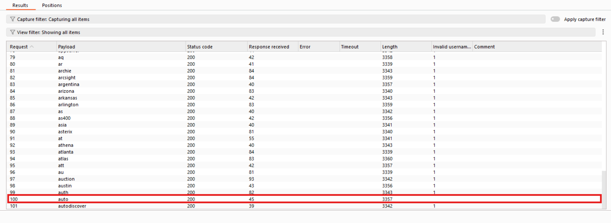
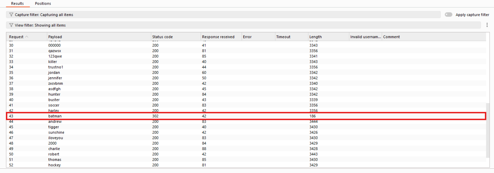

# Username Enumeration via Subtly Different Responses
##  Lab Description
This lab demonstrates a vulnerability where a web application leaks information about valid usernames through **subtle differences in authentication error messages**.

Although the error messages appear identical, a minimal difference (such as a trailing space instead of a period) allows an attacker to enumerate valid usernames and then brute‑force passwords.
**Lab Link:** [Username enumeration via subtly different responses](https://portswigger.net/web-security/authentication/password-based/lab-username-enumeration-via-subtly-different-responses)

##  Objective

- Identify a valid username by analyzing subtle response differences
- Brute‑force the password for the identified user
- Successfully complete the lab

##  Tools Used

- Burp Suite (Intruder)
- Web browser

---

##  Write‑up

### Step 1: Username Enumeration

Burp Intruder was used to enumerate usernames.
Grep – Extract was configured to extract the authentication error message
from the response body, enabling comparison of responses that appeared
identical at first glance.

For most requests, the extracted value contained characters
(indicated as `1` in the Intruder results table).
However, for one specific username, the extracted value was empty.

This discrepancy revealed that the application responded differently
when a valid username was supplied, allowing identification of a valid user.
.

📸 **Valid username identified:**  

---

### Step 2: Password Brute‑force

After identifying a valid username, a password brute‑force attack was performed using Burp Intruder.

One of the requests returned a **302 redirect**, indicating successful authentication.

📸 **Valid password identified:**  

---

## ✅ Result

The lab was successfully completed by exploiting subtle differences in authentication responses to enumerate a valid username and subsequently brute‑force the corresponding password.

---
## 🔒 Mitigation

- Use identical error messages for invalid usernames and passwords
- Normalize responses to avoid whitespace or punctuation differences
- Implement rate limiting and account lockout mechanisms
